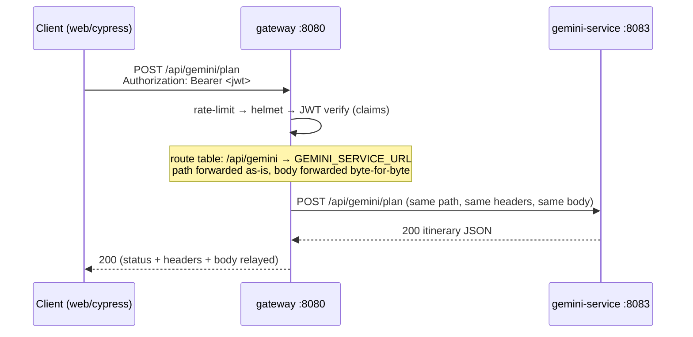

# Gateway (`services/gateway`, port 8080)

The single front door of the Smart Itinerary platform — the only service that
clients (web, mobile, third party) talk to directly. It implements the
**"API Gateway Instance 1 / Instance 2"** boxes of the AWS architecture
diagram: ECS runs it with desired count 2 to reproduce the two instances.

Responsibilities:

1. **Route forwarding** — maps public `/api/<area>/*` paths to the service
   behind them (route table in `src/upstreams.ts`). Forwarding is **transparent**:
   the path the client sent is the path the service receives
   (`/api/gemini/plan` → gemini-service `/api/gemini/plan`), so each service
   mounts its routers under the same public prefix.
2. **JWT verification** — every `/api/*` call must carry a valid token, in the
   `Authorization: Bearer <token>` header **or** the `si_session` session
   cookie (web flow). Verified with `@smart/shared`'s `createTokenVerifier` +
   `requireClaims`: Cognito JWKS in production (`TOKEN_VERIFY_MODE=cognito`),
   locally-signed HS256 tokens in mock mode (`TOKEN_VERIFY_MODE=dev`).
3. **Resilience** — upstream URLs come from the environment; an unset URL or an
   unreachable service is answered with `502 {"error":"<service> is down"}`.
   A dead dependency never crashes the gateway.
4. **Traffic safety** — `helmet` security headers + `express-rate-limit` on
   `/api/*` (never on `/healthz`, so probes aren't throttled).
5. **Mock auth** — `POST /api/auth/dev-token` mints a dev token so Cypress and
   offline development work without Cognito.

## A request's journey



Any failure inside the gateway pipeline is a JSON error from the shared
`errorHandler` — e.g. `401 {"error":"Invalid or expired token"}` for a bad
JWT, `502 {"error":"gemini-service is down"}` for an unreachable upstream.

## Endpoints (gateway-owned)

| Method | Path | Purpose | Notes |
|---|---|---|---|
| GET | `/healthz` | Liveness + upstream health aggregation | Always HTTP 200; body says `ok` (all upstreams up) or `degraded`, with per-service detail. Public, not rate-limited. |
| POST | `/api/auth/dev-token` | Mint a mock-auth JWT (also sets the `si_session` cookie) | **Only when `TOKEN_VERIFY_MODE=dev`** — answers 404 under cognito mode. Body (all optional): `{"sub","email","name"}`; `sub` defaults to `dev-user`. Returns `201 {"token","claims"}`. |

Everything else under `/api/*` is proxied:

| Public prefix | Upstream service | Default port | Env var |
|---|---|---|---|
| `/api/auth/*` | auth-service | 8081 | `AUTH_SERVICE_URL` |
| `/api/itineraries/*` | itinerary-service | 8082 | `ITINERARY_SERVICE_URL` |
| `/api/gemini/*` | gemini-service | 8083 | `GEMINI_SERVICE_URL` |
| `/api/tools/*` | tools-service | 8084 | `TOOLS_SERVICE_URL` |

Forwarding never rewrites the path (only hop-by-hop headers are dropped), so a
service's endpoints table is also its public API surface through the gateway.

## Environment variables

| Var | Default | Meaning |
|---|---|---|
| `SERVICE_NAME` | `gateway` | Service identity in logs / health output |
| `PORT` | `8080` | Listen port |
| `LOG_LEVEL` | `info` | pino log level |
| `TOKEN_VERIFY_MODE` | `dev` | `dev` (HS256 mock tokens) or `cognito` (JWKS). Missing Cognito config exits at boot — fail fast on misconfiguration. |
| `JWT_DEV_SECRET` | `dev-only-secret` | HS256 secret, dev mode only |
| `COGNITO_ISSUER` | — | cognito mode: `https://cognito-idp.<region>.amazonaws.com/<poolId>` |
| `COGNITO_CLIENT_ID` | — | cognito mode: app client ID (JWT `aud`) |
| `AUTH_SERVICE_URL` | — | auth-service base URL; unset ⇒ that area reports "down" |
| `ITINERARY_SERVICE_URL` | — | itinerary-service base URL |
| `GEMINI_SERVICE_URL` | — | gemini-service base URL |
| `TOOLS_SERVICE_URL` | — | tools-service base URL |
| `RATE_LIMIT_WINDOW_MS` | `900000` | Rate-limit window (15 min) |
| `RATE_LIMIT_MAX` | `300` | Requests per window per IP |

(`.env.example` mirrors this list.)

## Diagram mapping

| Diagram box | Where here |
|---|---|
| API Gateway Instance 1 / Instance 2 | This service; ECS desired count 2 (Terraform, T3.2) |
| Amazon Cognito | `TOKEN_VERIFY_MODE=cognito` — JWTs verified against the pool's JWKS |
| Clients (Web / Mobile / Third Party) | Web via the Next.js `/api/:path*` rewrite; others via Bearer tokens |
| Backend services | Route table → the four microservices above |

## Running locally

```bash
# 1. Infrastructure (databases, broker, MinIO, Mailpit) — not needed to boot the gateway
docker compose up -d

# 2. Point the gateway at services running bare on localhost (defaults from .env.example)
cp services/gateway/.env.example services/gateway/.env

# 3. Start the gateway (tsx, no build step — @smart/shared is pure TS)
npm run dev --workspace @smart/gateway

# 4. Try it
curl http://localhost:8080/healthz                                    # gateway health + upstream states
curl -X POST http://localhost:8080/api/auth/dev-token                 # mint a dev token
curl -H "Authorization: Bearer <token>" http://localhost:8080/api/auth/me   # proxied to auth-service
```

Notes for the curious:

- On AWS the same image runs behind the ALB; behind a proxy you'd add
  `app.set("trust proxy", …)` so rate limiting keys on client IPs (deliberately
  not defaulted to avoid header spoofing locally).
- Requests are forwarded with body and auth headers unchanged; services that
  need claims can re-verify via `@smart/shared` — no claims-forwarding
  contract needed between services.
